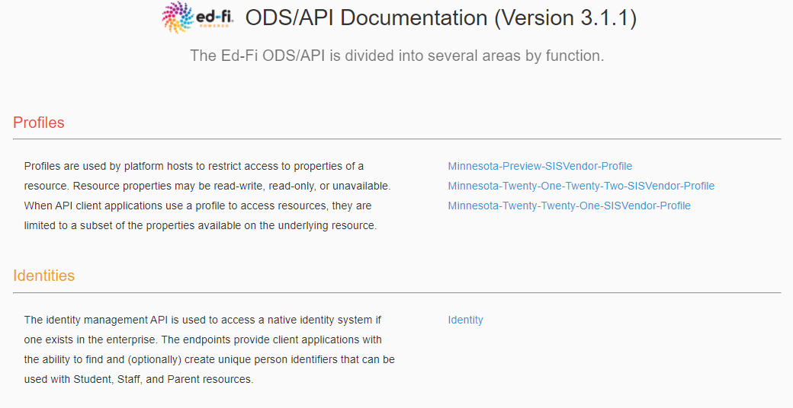

# Sandbox Certification Testing
When certification begins, vendors will be provided a key and secret to a sandbox [Operational Data Store (ODS)](https://techdocs.ed-fi.org/display/ETKB/Ed-Fi+Operational+Data+Store+and+API), accessible via API. This ODS will contain the Minnesota Education School and District records synchronized with [MDE ORG](https://public.education.mn.gov/MdeOrgView/), as well as the MN specific descriptors listed in this documentation. When submitting data for each of the Certification scenarios, we ask that you use a district you have access to, and schools within the district.

## Accessing the Sandbox
_Please note_ that for the 20-21 school year, sandbox environments now have ```sb20_``` in the base paths for the API. For example: ttps://test.edfi.education.mn.gov/**sb20_**/edfi.ods.webapi/data/v3/. This change will likely require a change in your integration code.

### Sandbox Admin Website
As part of Sandbox certification, you will need access to the [Sandbox Admin Site](https://test.edfi.education.mn.gov/sb20_/EdFi.Ods.Admin.Web). To request an account, [contact MDE by email](mailto:EdFiProjectSupportMNIT.MDE@state.mn.us). In the Sandbox Admin Site, you will be able to create ODS instances to use for development and testing of your integrations. ([The Ed-Fi TechDocs](https://techdocs.ed-fi.org/display/ODSAPI31/Using+the+Sandbox+Administration+Portal) have more detailed instructions on setting up sandboxes.)

### Swagger UI
Ed-Fi uses the [Swagger UI tool](https://swagger.io/tools/swagger-ui/) to visualize and interact with the ODS API. Developers can access this [UI for the Sandbox](https://test.edfi.education.mn.gov/sb20_/EdFi.Ods.SwaggerUI/) before building integrations as necessary.
Please note:
- All MN Specific resources defined for the **19-20** School Collection can be found under the **Minnesota-SISVendor-Profile**.
- All MN Specific resources defined for the **20-21** School Collection can be found under the **Minnesota-Twenty-Twenty-One-SISVendor-Profile**.
- All MN Specific resources defined for the **20-21** School Collection can be found under the **Minnesota-Twenty-Twenty-Two-Preview-SISVendor-Profile.**
- The Identities Section is not functional in the Sandbox and is provided as documentation only

Upon launch of the Swagger Sandbox UI, the site will finish loading the profiles and appear as follows:

Clicking one of the profile links will launch you into the Swagger UI for exploration. Once inside the Swagger UI, click the "Authorize" button to enter in the client id (key) and client secret created in the Sandbox Admin site.

### Sandbox Base and OAuth URLs
Developers can further test their code integrations at the URLs in this section. The base URL for the ODS/API is: ```https://test.edfi.education.mn.gov/sb20_/edfi.ods.webapi/data/v3/```

#### Extension vs. Core Resources
Note that Ed-Fi URLs vary based on whether or not core Ed-Fi standard or MN extensions are being accessed:
- **Extensions**: The URL for addressing MN extension resources should include ‘mn’ after v3. For example, when addressing _studentSection504PlanProgramAssociations_, a Minnesota extension entity, the URL is: ```…/edfi.ods.webapi/data/v3/MN/studentSection504PlanProgramAssociations```
- **Core**: The URL for addressing core resources should include ‘ed-fi’ after v3. For example, when addressing _StudentSchoolAssociation_, a core Ed-Fi entity, the URL is: ```…/edfi.ods.webapi/data/v3/ed-fi/StudentSchoolAssociation```

**Important Note:** the school year must be included after **“/v3/”** and before the core/extension namespace in QA, Stage and Production, but **not in Sandbox**. For example:
```…/edfi.ods.webapi/data/v3/2021/ed-fi/StudentSchoolAssociation```
```…/edfi.ods.webapi/data/v3/2021/MN/studentSection504PlanProgramAssociations```

The Sandbox ODS/API oauth URL is: ```https://test.edfi.education.mn.gov/sb20_/edfi.ods.webapi/oauth/```

Authentication In Ed-Fi 3.x ODS/API has been updated to use two-legged OAuth 2.0 Client Credentials Grant Flow. More information and sample API calls are located in [the Ed-Fi Techdocs](https://techdocs.ed-fi.org/display/ODSAPI32/Authentication).

## Sandbox Tips
- In the staging and production environments, SIS vendor API keys will be associated with a claim set limiting access to only the API resources included in this document. This claim set has been enabled in the Sandbox environment. When you access a resource not included in the claim set you will receive the following message in the response: ```Access to the resource could not be authorized. Are you missing a claim?```
- A SIS Vendor profile has been created limiting access to specific properties on each of the resources required in School Year 19-20.  This is available in the API section: “Profile: Minnesota-SISVendor-Profile”
  - This profile will be auto-enabled in Staging and Production – meaning you will not have to include the profile in the “accept” or “content-type” headers of the request for the profile to take effect.
- When creating a sandbox, you have the option of including a set of sample data in the sandbox. The sample data used, is associated with St. Paul Public School District (LocalEducationAgencyId = 10625000). When you do not select the option to include sample data, your sandbox database will be loaded with an essentially empty ODS, except that it will include MN Schools and Districts, and the Descriptors that MDE has customized for this implementation.  
- The actual certification test will be conducted in a sandbox with no sample data loaded and you will reference your own MDE Schools, Districts and Descriptors in the Scenarios.
- The Sandbox environment ignores the School Year included in the API base URL. When preparing submissions to Staging and Production, remember to include the year, i.e. "2021". 
- The School IDs and District IDs used for the ODS/API resources are the MDE State Organization IDs (stateOrganizationID). See section below for details.
- MN custom descriptor codes have been loaded under the namespace ```uri://education.mn.gov/```
- Assessment specific descriptors for the MCA/MTAS and Access/Access-ALT assessments have been namespaced as follows with a reference to the assessment in the namespace:
  - ```uri://education.mn.gov/mcamtas/assessmentReportingMethodDescriptor```
  - ```uri://education.mn.gov/access/assessmentReportingMethodDescriptor```
- All Descriptor references now require namespaces, and do not rely on the concept of a default operational context. Descriptor references must be formatted as follows: ```uri://[organization indicator]/[name of descriptor]#[code value]``` For example: ```uri://education.mn.gov/ProgramTypeDescriptor#Special Education```
  - This can be seen when updating a studentSchoolAssociation record. For example, within the MN extension part of the record (shown below), the code value for ```membershipAttendanceUnitDescriptor``` is not merely "Days", but **"MembershipAttendanceUnitDescriptor#Days"**:
  ```javascript
  "_ext": {
    "MN": {
      "homeboundServiceIndicator": true,
      "specialPupilIndicator": true,
      "residentLocalEducationAgencyReference": {
        "localEducationAgencyId": 10625000
      },
      "membership": {
        "membershipAttendanceUnitDescriptor": "uri://education.mn.gov/MembershipAttendanceUnitDescriptor#Days",
        "attendance": 180,
        "membership": 180,
        "percentEnrolled": 100
      },
      "transportation": {
        "transportationCategoryDescriptor": "uri://education.mn.gov/TransportationCategoryDescriptor#01",
        "transportingLocalEducationAgencyReference": {
          "localEducationAgencyId": 10625000
        }
      }
    }
  }
  ```

## Minnesota District and School IDs
The MDE **stateOrganizationID** (assigned in MDE ORG) is formatted as follows: ```ttddddsssmmm```, where:
- ``tt`` = district type
- ``dddd`` = district number, left zero filled
- ``sss`` = school number, left zero filled, 000 for districts
- ``mmm`` = 000 for all organizations reported in Ed-Fi
 
The MDE **stateOrganizationID** value is stored in Ed-Fi on the Ed-Fi **EducationOrganizationIdentificationCodes** collection and is surfaced via the Ed-Fi **LocalEducationAgencies** and **Schools** resource endpoints. 

The Ed-Fi **LocalEducationAgencyId** and **SchoolId** are derived as follows: ```ttddddsss```.  The final three digits in ```sss``` are always zero filled (```000```) for the LocalEducationAgencyId. 

Examples: 
- The MDE State Organization ID for [Mayo Senior High](https://public.education.mn.gov/MdeOrgView/organization/show/2734) (an individual school) is ```10535315000```. The corresponding Ed-Fi SchoolId is ```10535315```.
- The MDE State Organization ID for [Rochester Public School District](https://public.education.mn.gov/MdeOrgView/organization/show/527) (an LEA) is ```10535000000```. The corresponding Ed-Fi LocalEducationAgencyId is ```10535000```


